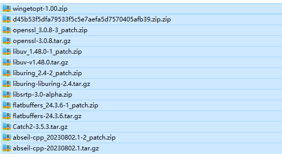

### sfu-server

忘记从哪里复制来的代码了，乱改了一下，基于`mediasoup`的 webrtc sfu服务器

### 使用mediasoup前请阅读 https://mediasoup.org/documentation/v3/mediasoup/installation/

### window上使用mediasoup请到mediasoup的官网下载mediasoup-worker-window并参考官方文档的相关方法配置`MEDIASOUP_WORKER_BIN`


下面的方法仅适合`3.14.7`左右的`mediasoup版本`,只保留仅作不时只需

##### ~~自动编译不过的时候参考下面的放肆 linux上编译,本人使用kali(python3) 最新的测试过~~

- 建议使用gcc 11等高版本编译，避免出现无法正常使用等问题 可以使用devtoolset 安装 gcc 11

- `npm install -verbose --registry=https://registry.npmmirror.com --ignore-scripts` 安装相关依赖

- 可以提前安装好 meson

- 由于网络问题，建议提前下载相关文件，具体文件请浏览`~/…/node_modules/mediasoup/worker/subprojects`下的`*.warp`文件，下载后放到`packagecache`文件下, 没有文件夹就在subprojects下新建一个

文件的名字参考source_filename和patch_filename

参考图片

 

 ~~旧包 版本可能不对 链接：https://pan.baidu.com/s/1xdEEyOQTY4Sxyernsu0XDw  提取码：gd7x  下载相关文件~~

- 之后运行
  
  ```
  (kali㉿kali)-[~/…/electron-webrtc-meeting-room/sfu-server/node_modules/mediasoup]
  $ node npm-scripts.mjs worker:build
  ```

##### window上使用mediasoup请到mediasoup的官网下载mediasoup-worker-window并参考官方文档的相关方法配置`MEDIASOUP_WORKER_BIN`

- 客户端与服务器websocket交互流程(省略返回)

```sequence
client ->> server : createRoom 创建房间
client ->> server : join 加入房间
client ->> server : getRouterRtpCapabilities 获取编码器和解码器
client ->> server : createWebRtcTransport 携带参数rtpCapabilities，表示创建一个生产通道
client ->> server : createWebRtcTransport 不携带参数rtpCapabilities，表示创建一个消费通道
client ->> server : getProducers 获取房间中的生产者
```